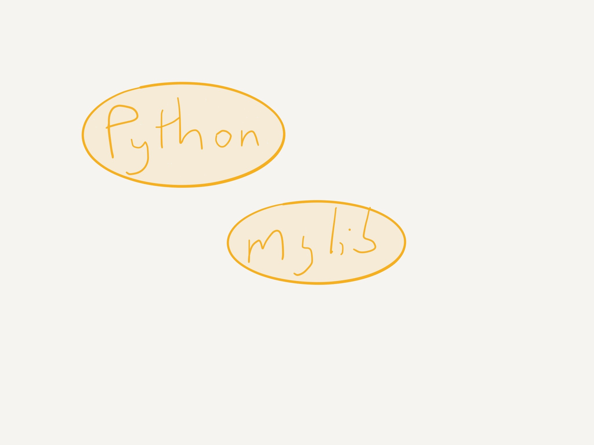
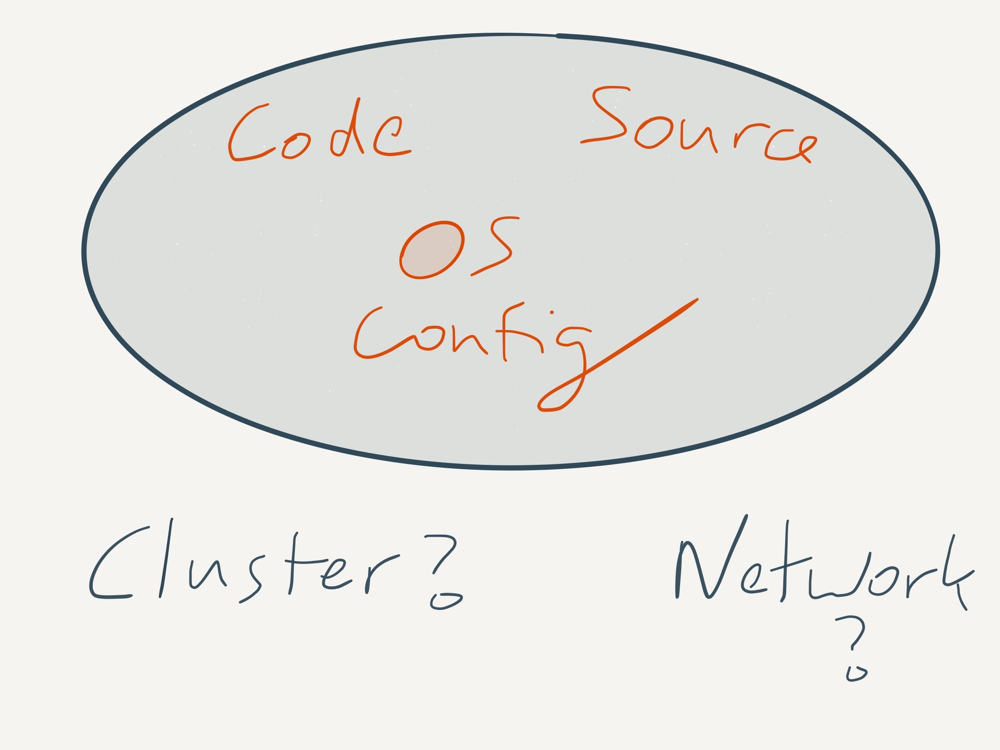

# [fit] Nix
## Python Ireland
## December 2015
### Michael Twomey

---

# [fit] What is this talk about?
# [fit] Package management and builds!
# [fit] Please! Don't leave!

---



---

# [fit] Problem? 
# [fit] What problem?

---


---

# Virtualenv!

# [fit] What about Ruby? Java?
# [fit] PostgreSQL? Blas? Libc? Openssl?

^ Only handles the python case
^ Doesn't handle upstream dependencies (python itself, libraries, even your libc)
^ What about ruby? rvm
^ How do you mix this stuff?
^ MySQL? Postgresql?

---


---

# [fit] Docker!

```dockerfile
FROM docker/whalesay:latest
RUN apt-get -y update && apt-get install -y fortunes
CMD /usr/games/fortune -a | cowsay
```

# [fit] Will it be the same if I run this tomorrow?
# [fit] What did I just build anyway?

---


---

# Reproducible Builds
# [fit] Not just today, but next year

^ Sometimes in some lines of work you have to debug something very precisely
^ It's also nice to know things don't change under your feet
^ e.g. mac -> linux

---

# What is Nix?
# [fit] Functional!
## (It works too)

^ Started as a phd thesis on functional package management
^ 10 years old
^ First Nixcon this year

---

# Homebrew Replacement

^ Simplest way to use Nix
^ They bootstrap *everything*, even Darwin build tools and libs

---

```sh
$ nix-env -i postgresql
```

^ Old school (Nix started when rpm was fashionable), about ten years ago

Coming soon:

```sh
$ nix install postgresql
```

(with emoji 😀)

^ Community recognizes they need to work hard on usability and docs
^ Yep, the docs are pretty bad for learning (ok reference)
^ I've had to work hard to understand what I can

---

# [fit] This installed PostgreSQL in my user profile
## Not system wide
## Slightly Interesting

^ Can have multiple profiles and each user gets their own by default
^ Can have multiple versions of PostgreSQL on the machine

---

# [fit] Per Project Development Environment?

---

# ~/src/myproject/default.nix

```nix
with import <nixpkgs> {}; {
    pyEnv = stdenv.mkDerivation {
        name = "py";
        buildInputs = [
            nodejs
            postgresql
            python34Packages.virtualenv
        ];
        shellHook = ''
        unset PYTHONPATH
        export LC_ALL=en_IE.utf-8
        '';
    };
}
```

^ Nix has a full language

---

```sh
$ nix-shell --pure
$ type -a python3
python3 is /nix/store/lwq4k9vh197mrbgzcvrd6y25yvzp3vcd-python3-3.4.3/bin/python3
```

---

# [fit] lwq4k9vh197mrbgzcvrd6y25yvzp3vcd-python-3.4.3?

> cryptographic hash of the package’s build dependency graph

Even the sources get a hash too

Change build options? New hash!

^ Enables many powerful things, composing with multiple versions, moderately reproducible dependencies
^ They're still working on 100% reproducible binaries (hard problem)

---

# Project A

```
<ham>-python-3.4.3 + <eggs>-lib-1.0
```

# Project B

```
<spam>-python-3.4.3 (+ weird options) + <eggs>-lib-1.0
```

---

# [fit] Can dump the entire closure 
# [fit] big!
# [fit] Hello Docker

^ Pretty much how you install nix, decompress a closure of /nix
^ Nix splitting outputs so you can exclude stuff like includes and man pages in your closure

---

# [fit] Can also export all the packages
# [fit] + their sources!

---

# [fit] Future
# [fit] Content Addressible Packages
# [fit] Splitting outputs by type (headers, etc)
# [fit] Friendlier commandline & docs

---



---


---

# [fit] Not Just Packages

# [fit] NixOS

# [fit] NixOps

---

# [fit] Links

# [fit] https://github.com/micktwomey/nix-talk/
# [fit] https://nixos.org/nix/
# [fit] https://nixos.org/nixpkgs/manual/
# [fit] https://nixos.org/nix/manual/
